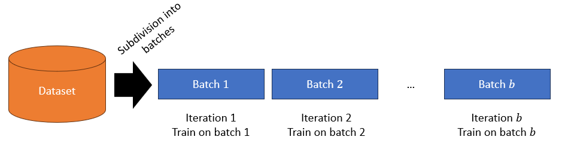

# Assignment 2: The Database
## Members
__Group:__ 33

__Members:__

- Chirag Dinesh Ramchandani (S5881919)
- Tien Huy Anh Luu (S5906261)

## Preliminaries

In Machine Learning, data management is an important point to consider.
Data can convey different information according to the specific problem at hand.

All datasets contain a specific data, which we will generically denote with the letter $X$.
Depending upon the task, this data can be rows in a table, images, audio files, etc.
Also, depending on the data itself, this could be stored as a large array or matrix, or it could be a large number of files stored in a specific folder of a disk.

### Supervised and Unsupervised Learning, Training and Inference

In **Supervised Learning**, the data $X$ is accompanied by a ground truth $y$.
An example of it is the interactive explanation of linear regression seen in class: given some characteristics of a car ($X$) predict its fuel consumption ($y$).
We are explicitly providing the fuel consumption to the model during the **training** phase, in the hope that it is able to provide sensible information when we will deploy it (**inference** phase), and the labels will not be available anymore.


An example of application of linear regression, a simple supervised learning method.
In this example, a line is fit such that it *optimally captures* the relationship between height ($x$) and weight ($y$) of a person.
The goal is to predict the weight given the height of a person.
During the training phase, pairs $(x,y)$ are provided to the model, and the predictions $\hat{y}$ are adjusted to minimize the error between $y$ and $\hat{y}$.
During the inference or testing phase, only $x$ is provided and a prediction $\hat{y}$ is formulated.

**Unsupervised Learning**, instead, is a different framework whereas we do not have labels, only the data $X$, and the model has to learn structure in the data.
An example could be the following: you are provided with a list of users of an online streaming platforms. 
The list includes some demographics, plus the videos they watched in the last year.
The goal is to create **clusters** of the users according to the data at disposal, so that new users, which are currently not registered into the platform, can be categorized into one of these clusters, and we can provide them with recommendations of videos according to videos seen by other users within the same cluster.


Example of clustering on a toy dataset.
Here, $X$ is composed of two features (x- and y-axes) and there is no explicit $y$.
The algorithm here separates the data into three clusters, which may or may not have a semantic meaning.


### Loading of data from disk (eager vs lazy)

Since the data is on disk, it needs to be loaded into memory (or often even GPU memory) to be accessed for the training.
There are multiple strategies for optimal loading of the dataset, and here we present two:

**Eager loading** refers to the loading of the data straight for memory before training.
When a dataset is instantiated, it proceeds to load the data all-in-one, so it can be accessed quickly for the training.
This strategy is used when you are dealing with *small datasets* that can easily fit in memory.

**Lazy loading** refers to the loading of a *single data point* only when requested.
When a dataset is initialized, it only has *pointers* to the data in the disk (which consume very little memory) and proceeds to load the data when it is requested during training or inference.
This strategy is to be preferred when the whole of the data cannot fit into memory at the same time (it is fairly easy nowadays to have datasets with size >1TB).
For instance, neural networks tend to utilize stochastich training methods, which only use a fraction of a data in an iterative fashion.


As shown in the image, the model is sequentially trained only on one batch at the time.
Only the fraction of the data in each batch is needed at the same time; the rest can remain on disk, saving a lot of memory.


### Data preprocessing and augmentation

Often the raw data needs to be **preprocessed** to be useful for training a model.
For instance, a common preprocessing method is normalization.
Considering a single feature $x$, we would like the data to be *squished* in the $[0-1]$ range (or in the $[-1,1]$ range).
The preprocessing function can thus be applied accordingly. Given a data point $x^{(i)}\in\mathbb{R}$:

$$
x_{\text{normalized}}^{(i)} = \frac{x^{(i)}-x_{\min}}{x_{\max}-x_{\min}},
$$

where $x_{\min}$ and $x_{\max}$ are the minimum and maximum values for the feature $x.$

Dataset are intrinsically limited, potentially leading to a model **memorizing** only the patterns present in the dataset, and being unable to generalize to new patterns.
For this reason, we can apply **augmentation** strategies, to modify, using a **stochastic** function, every single data point, so the model always (or often) sees a small variation of the data, instead of the same data point every iteration.
An example is the addition of a small noise term to the data point.
Considering $x^{(i)}\in\mathbb{R}$,

$$
x_{\text{perturbed}}^{(i)} = x^{(i)} + \varepsilon,
$$

where $\varepsilon \sim \mathcal{N}(0,\sigma^2)$, $\mathcal{N}(0,\sigma^2)$ being a Gaussian distribution with 0 mean and a small variance term $\sigma^2>0$.

Another example, in the image domain, is represented by color jittering, which modifies properties of the image, such as contrast and brightness.


This figure illustrates the application of color jittering to the image to the left.

An important distintion between **preprocessing** and **augmentation** is the following:
* Preprocessing is **deterministic** and can technically be applied *before* the data is used for the training. Often, though, we prefer not duplicating the dataset on the disk (especially if the dataset is large) and we apply the preprocessing *while* the data is loaded onto memory.
* Augmentation is **stochastic** and thus can only be applied *during* training, when the data point is requested by the model.

We generically use the term "transform" to indicate either a preprocessing or augmentation function.

### Data: audio and image

For this assignment, we will concentrate specifically on two types of data: audio and image.
We will be using the libraries librosa and OpenCV (`cv2`) for working with them.

#### Audio

For what concerns **audio files**, the audio are expressed as signals over a specific time step. The signal is also called a *waveform* and is represented as a vector $\mathbf{x}$, with each of its consecutive values $x_i, x_{i+1}$ being separated by a fixed time interval called *sampling rate*. In some cases, the audio signal is formed as a composition of multiple waveforms forming different *channels*. In this case, we can view the signal as a matrix $X\in\mathbb{R}^{t \times c}$, with $t$ being the time steps and $c$ the number of channels.

In order to reproduce the audio, both the waveform and the sampling rate are needed. When opening an audio file with librosa, both quantities are returned:

```
waveform, sampling_rate = librosa.load("location/of/file.wav")
```

Librosa already provides built-in functions for data preprocessing and augmentation.

For a basic introduction on audio files, I can recommend [this video](https://youtu.be/bnHHVo3j124) from data scientist Valerio Velardo.

#### Images

**Image data** is usually represented as a three dimensional structure $X\in\mathbb{R}^{h\times w\times c}$, where $h$ and $w$ are the height and width of the image and are also known as *spatial dimensions*, while $c$ is the number of channels, which depend on the encoding through which the image is represented.

Grayscale images only have one channel, and are thus representable as a $h\times w$ matrix. Each element, called *pixel*, in the matrix stands for the intensity of light in the current position. 0 indicates pitch black, while 255 (the maximum by default) indicates bright white. An example below:


For color images, there are a handful of encodings, although the most common overall is the RGB color scheme: R stands for Red, G stands for Green, B stands for Blue.
The image is a $h\times w\times 3$ structure (3 being the RGB *channels*)


Each of the three matrices represent the intensity of the red, green, and blue colors respectively.
To show the image on a monitor, each pixel in the display has red, green, and blue lights, whose intensity is set according to the pixel values; the human visual cortex does the rest for perceiving these three distinct colors as a single one.


Images can be loaded in this way:

```
import cv2

image = cv2.imread("location/of/file.png")
```
**Notice that no exception is occurring if the image path doesn't exist: the content of `image` is just `None`**. Be careful of using this information when constructing and debugging your code.

## Instructions for the assignment

In this assignment, you are required to create a Dataset structure to manage data (specifically audio and images) in the context of a Machine Learning workflow, specifically for **supervised learning** (so, we have data **and** labels).
The dataset should be able to load (either in a lazy or eager way) an audio or image file and return it to the user upon request.

### 0. structure of the repository

The repository should have this structure:

```
(root)
  |
  - .github/ # administrative folder - DO NOT TOUCH!
  - datasets/ # your library
     |
     - __init__.py # for having it correctly work as a library
     - dataset.py # ABC and concrete implementation
     - transform.py
     ... # you are allowed to create more files if needed (e.g., a utils script)
   - data/
     |
     - <your image and audio dataset folders here. MAX 10 MB PER DATASET!>
   - tests/
     - <your test python files here>
   - main.py # for the demonstration
   - README.md # this readme
   - <uv environment files>
   - .gitignore # automatically added by uv. Remember to add a line for the .vscode/ folder if present.
```

### 1: dataset preparation

You should prepare two small datasets of images and audio files respectively.
The dataset has to be a **classification dataset**.
Each dataset can have a **maximum of 10 MB of size**.
Assign images/audios in at least 2 different categories.
Organize your dataset in a folder according to this hierarchical scheme, so that files belonging to a given category are stored in a specific subfolder:

```
data/
  |
 my_dataset/
    |
    - category_1
      |
      - file_1_category_1
      - file_2_category_1
      ...
    - category_2
      |
      - file_1_category_2
      - file_2_category_2
      ...
   - ---
```

### 2: dataset basics & loading the data and labels (eager AND lazy)

All datasets have a constructor which accepts one argument, called `root`.
The root is the base directory of the dataset to be loaded.
In the dataset from part 1, the root is the folder `my_dataset`.

When constructed, the dataset proceeds to store the root as an attribute.
Evaluate wheter this attribute should be public or private, and whether to give read-only or write access to it.
After having stored the attribute, the constructor proceeds to load the data (see next paragraph). 

All datasets should have a `load` method which loads the data and labels upon instantiation.
Consider whether to make this method public or private.

An eager dataset should load all the data and labels and store them in a `data` attribute. Remember that the data also includes a label!

Notice that the label should be created consistently with the folder structure highlighted in Section 1.
The type of the label is defined depends on your choice, but the optimal solution is to assign an `int` (starting from 0) to each of the folders containing the data and use that instead of, e.g., strings.
This is the strategy adopted by most of the machine learning library (e.g., PyTorch, scikit-learn...).

In order to aid with the loading of the data, all datasets should have a submethod called `load_single_data`, which is used by the dataset to load a single datapoint into memory.
This method only loads the proper data point and not the label.
According to the specific type of dataset, it should be used either in the `load` method or in the `__getitem__`.
Consider whether to make this method public or private.

**Note1**: you may need to specify complex type hints.
When returining a tuple of different objects (let's suppose you have a method returing a np.ndarray, an int, and a float: you can specify the return type hint as follows `tuple[np.ndarray, int, float]`.

**Note2**: sometimes, you may find functions returining different objects, conditioned to the specific type of dataset.
For instance, if a method may return a float or a np.ndarray, you can specify the return type hint as follows: `float | np.ndarray`. 

**Note3**: when dealing with complex type hints, code readability may be hampered.
You can use shorthands for such type hints by defining, in the script header, a custom type, and you can use this shorthand throughout your code.

_Example_:

_before_
```python
def my_complex_function() -> int | tuple[int, np.ndarray]:
  pass
```

_after_
```python
MyComplexType = int | tuple[int, np.ndarray]

def my_complex_function() -> MyComplexType:
  pass
```


### 3: getting the data

All datasets should implement a data getter by means of the `__getitem__` method (aka "brackets operator"). You can refresh its functioning quickly [here](https://www.geeksforgeeks.org/python/__getitem__-in-python/).
The idea is that a single data point should **only** be obtained directly in the following way:

```
dataset = MyDataset(...)
index = 123
data_point, label = dataset[index]
```

Notice that, in the case of the lazy dataset, this is the moment in time in which the image or audio file is actually loaded into memory using the file path information stored in the `data` attribute.

`__getitem__` should be the only method of the datasets that allows you to obtain a data point from the dataset.


### 4: the abstract class

Create an **Abstract Base Class** (ABC) for a dataset. This should represent the basic properties and behaviors of a dataset as described above.

Within this context, think of 

(1) which attributes and methods are generic and present in all possible implementations of datasets according to the instructions. Think of the following question: "Is the behavior the same in all classes? Am I always using the same attributes and computations regardless of the implementation?" In this case, you can already implement the method in the ABC. If you find behaviors which are common to all classes, but use different computations in the process, then that method should be **abstract** and its implementation should be delegated to the children classes.

(2) which attributes and methods are instead specific to the implementation. An example could be a particular type of audio processing function which cannot be implemented for images. In this case, the attributes and methods should not be indicated in the ABC and should only be implemented in the relevant children classes.

**Note:** although it may not be specifically necessary, you are allowed to create intermediate ABCs after the `Dataset` class if you find there may be multiple levels of abstraction.

### 5: types of datasets

You are required to create a total of four different datasets as a combination of *eagerness vs lazyness* and *audio vs images*.

Use inheritance (multiple if necessary) and mixins in case you encounter diamond problems.

### 6: exceptions

In the image and audio datasets you should create two exceptions that are raised when an image or audio file does not exist.
Call the exceptions `ImageNotFoundError` and `AudioNotFoundError` specifically.
Notice that `cv2` and `librosa` have different behaviors when the required file does not exist. On opening...
* `cv2` returns `None`
* `librosa` raises a `FileNotFoundError`.

The exception should be raised on file opening, so you should catch the conditions on which the error happens (re-raising an existing error, if needed) within the `__getitem__` call in a lazy dataset, within the initialization code in an eager dataset.
Specifically, you should not raise an error by searching if the file exists on file system (e.g., using `os`); the error has to be raised when you call `cv2.imread` or `librosa.load`.


### 7: testing

You are required to provide some unit tests for verifying the correct functioning of your code.

1. **ABC unit test**: verify that the ABC correctly implements the structure required by this document (e.g., verify that it implements a `__getitem__` method).
   
   *Hint*: use a combination of `hasattr` and `callable` for checking if a class implements an attribute/method. Additionally, you can check if a method is abstract with the `inspect.isabstract` function.
   
   *Why is it important?* This test ensures that future modifications of the ABC don't inadvertently change the intended structure.

3. **Lazy loading**: verify that the lazy dataset correctly loads the data paths.
4. **Eager loading**: verify that the eager dataset correctly loads the data.

    *Hint*: to make it truly a unit test, you will need to mock the file system. Use [https://github.com/pytest-dev/pyfakefs](pyfakefs) for the task.
5. **Lazy `__getitem__`**: verify that the lazy dataset correctly loads the data using `__getitem__`.
6. **Eager `__getitem__`**: verify that the eager dataset correctly loads the data using `__getitem__`.
7. **Custom exceptions**: check if the custom exceptions are correctly raised in case an audio or an image does not exist. One test case for image, one for audio.


### 8: demonstration


Demonstrate the usage of each of the datasets: load the data, get the data, plot the image or play an audio file as a result of this.
To showcase the difference between the eager and lazy datasets, print the content of the `data` attribute for a specific index.
Put this demonstration in the `main.py` file.

### 9: grading information

The grading will take into consideration both **program correctness** and **coding style**, specifically the adherence to the OOP coding principles encountered until lecture 5 (September 18th, 2025).
The grading will be decomposed as follows:

| Component      | Points     |
| ------------- | ------------- |
| Program Correctness | 3 |
| Style | 3 |
| Testing | 3 |

In order to get to higher grades, you will be required to implement extra functionalities to your codebase (see next sections).

**Notice: if the tests are not implemented or severely lacking, the maximum attainable grade is capped at 7, regardless of extra work having been correctly implemented or not.**

### 10: extras

#### 10.1: Transforms (preprocessing and data augmentation) + ABC

You are required to implement up to four preprocessing or data augmentation steps for your dataset.
Each step should be implemented as a separate class.
Each class should implement a `process` method, which operates the processing on a single data point. **This method should only have the data point as argument**. All of the other arguments need to be passed in the constructor.

For the preprocessing, choose **up to four** of the following, considering that you have to implement _at least 1 image-specific transform_, and _at least 1 audio-specific transform_:

1. Normalization: given a minimum and maximum value (call them $m$ and $M$ respectively, with $m<M$), each image or audio file is normalized following this formula:
   
   $x_\text{normalized} = \frac{x-m}{M-m}$
   
   In this way, what was previously $m$ becomes 0, while what was previously $M$ becomes 1.
2. Standardization: similar to normalization, but the standardization aims at having the data distributed in the range of a standard Gaussian.
   Given $\mu$ (mean value) and $\sigma>0$ (standard deviation value), the data is standardized according to this formula:
   
   $x_\text{standardized} = \frac{x-\mu}{\sigma}$

3. Square erasing for image: given a maximum square size $S>1$, randomly draw an integer number $s$ in the interval $[0,S]$.
   Remove a square of size $(s,s)$ from the image at a random position. Ensure that you don't go out of the image boundaries when removing the square.
   Replace the square you just removed with black pixels.

   

5. Image center crop: given a maximum square size $(S,S)$, with $S>1$, if the input image has one of the two sides $>S$ crop it to size $(S,S)$.
   Don't crop a side if it is of size $\leq S$.

   

7. Audio random cropping: given a time interval of length $t$, randomly select a portion of the input of length $t$. No cropping should occur if the input has smaller size than $t$. Choose smartly the starting point: don't go out of the boundaries of the audio file when cropping. **The input length $t$ should be specified in seconds, so be careful at converting it into actual time steps according to the audio sampling rate**.

   

9. Spectrogram conversion: given an audio data point (vaweform + sampling rate) convert it to spectrogram

  

Create an Abstract Base Class (ABC) called `DataTransform` implementing a generic abstraction, **valid for all data types**, of the transformations.

Finally, update the Dataset implementation to include an optional construction argument `transform` of the type of your ABC.
The argument populates a *private attribute* (also called `transform`).
Provide additional getters and setters for the attribute.
The `transform` attribute will be called in the context of the `__getitem__` method and will be called whenever a new data point is obtained from the dataset, thus transforming the data point that will be returned.

Create a getter and a setter (using `@property`) for the transform attribute that allows you to get the transform (without leakage) and to set another transform in its place.

*Grading: each correctly implemented transformation will give you up to 0.4 pts (capped at 1.6). The ABC will give you up to 0.4 pts.*

#### 10.2 Demonstration of extra

Add the following requirement the demonstration of the compulsory workload:

on the datasets you created for the demonstration, add a transform for image on one, a transform for audio on the other.
Display the transformed image and play the transformed audio (created by calling `__getitem__`).

## Suggested workload organization and tips

* Week 1:
  * Without worrying too much about inheritance, start working on the constructor for the dataset, the load and load_single_data methods. You can work with one concrete class example (e.g., a lazy image dataset) and then worry about the differences that either (a) a eager dataset or (b) an audio dataset have.
  * After lecture 5, organize your inheritance hierarchy: create the ABC and find ways to work with inheritance. Notice that you may easily encounter the diamond problem, so work smartly with mixins or other strategies.
  * Do not overcomplicate the exceptions part! A smart implementation of these take 4-5 lines of code max.
* Week 2:
  * Concentrate on the testing part
  * If you have time left, consider implementing the preprocessing/transforms part.
 
Other tips to help:
* When dealing with paths, consider using the `pathlib.Path` object instead of the `os` library: pathlib is object-oriented and offers much more intuitiveness than os. For instance, you can use the `iterdir` method to iterate through a folder, and you can use the `is_folder` and `is_file` methods to check whether a filesystem object is a file or a folder respectively.
* In the loading of the data, it may be very useful to keep track of the folder id with an integer. You can achieve this by means of the [`enumerate`](https://www.w3schools.com/python/ref_func_enumerate.asp) keyword.

## Submission information

Remember to append your names and group number to this readme file before submitting.

Submission must be operated **on Brightspace** by pasting your repository URL.

Remember to commit and push all modifications before the deadline: all overdue pushes will be rolled back when grading.

